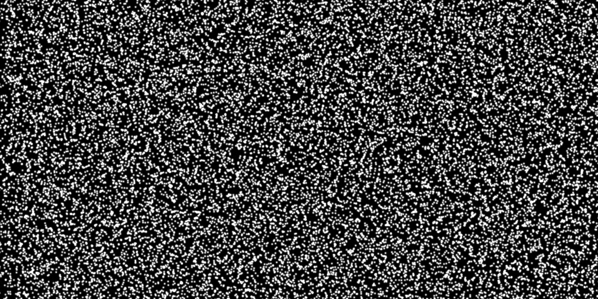
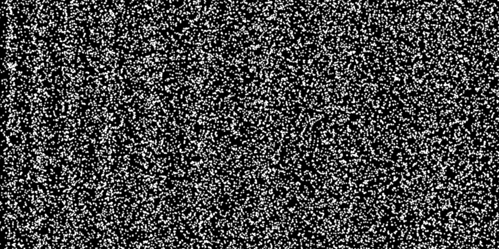
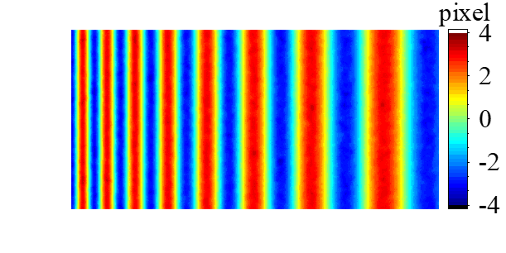

<<<<<<< HEAD
=======
# U-DICNet (Pytorch implementation)

U-DICNet estimates local complex deformation with high-order gradient from pairs of reference and deformed images of speckle pattern, as Digital Image Correlation (DIC) does. See paper [1] for details. 

If you find this implementation useful, please cite reference [1]. 

## Prerequisite

Install the following modules: 

```
pytorch >= 1.2
torchvision
tensorboardX 
imageio
argparse
numpy
pandas
shutil
glob
time
opencv >= 3.4
cuda >= 11.1
cudnn >= 7.5
```

## Training
1. Generate Speckle dataset
    dataset generation.m
    re*.bmp, tar*.bmp, u*.csv, v*.csv should be stored in the same folder
2. Specify the paths to:
    Train dataset, Test dataset
3. Execute the following commands
```
python dis_train.py --arch U_DICNet --train_dataset_root /path/to/training_dataset --test_dataset_root /path/to/test_dataset
python dis_train.py --arch U_StrainNet_f --train_dataset_root /path/to/training_dataset --test_dataset_root /path/to/test_dataset
python dis_train.py --arch StrainNet_f --train_dataset_root /path/to/training_dataset --test_dataset_root /path/to/test_dataset
```

## Running inference

The images pairs should be in the same location, with the name pattern re*.ext  tar*.ext

```bash
python inference.py  --arch U_DICNet --img_dir /path/to/input/images/ --pretrained /path/to/pretrained/model
python inference.py  --arch U_StrainNet_f --img_dir /path/to/input/images/ --pretrained /path/to/pretrained/model
python inference.py  --arch StrainNet_f --img_dir /path/to/input/images/ --pretrained /path/to/pretrained/model
```

## pretrained model
The pretrained model of U_DICNet are avaliable at [google drive](https://drive.google.com/file/d/1vtCL7nBXYUPYgWmKGc2iuZGEb4zFY5md/view?usp=share_link) and [百度云盘](https://pan.baidu.com/s/1N99rpZ7-OOgSm6SAvOUo9A?pwd=76tk)


## cellular deformation measurement

Execute the following commands in the U_DICNet directory (please also copy here the tar files if you use the pretrained models)

```bash
python inference.py  --arch U_DICNet --img_dir ../sinusoidal_deformation/ --pretrained U_DICNet.pth.tar

```
The output of inference.py can be found in ../sinusoidal_deformation/

The reference image ,target image, and the result are shown below

|Reference image        |    |
|:----------:|:---------------------------------------------:|
|Target image           |   |
|Retrieved by U_DICNet  | | or | |


## References 
[1] Lan S H, Su Y, Gao Z R, et al. Deep learning for complex displacement field measurement[J]. Science China Technological Sciences, 2022, 65: 3039-3056.

https://link.springer.com/article/10.1007/s11431-022-2122-y

DOI
https://doi.org/10.1007/s11431-022-2122-y

## Acknowledgments

This code is based on the Pytorch implmentation of FlowNetS from [FlowNetPytorch](https://github.com/ClementPinard/FlowNetPytorch)
and the Pytorch implmentation of StrainNet from [StrainNetPytorch](https://github.com/DreamIP/StrainNet)
>>>>>>> 38a316db5ce66ad2a4143ea86c562b0b63705002
# U_DICNet
